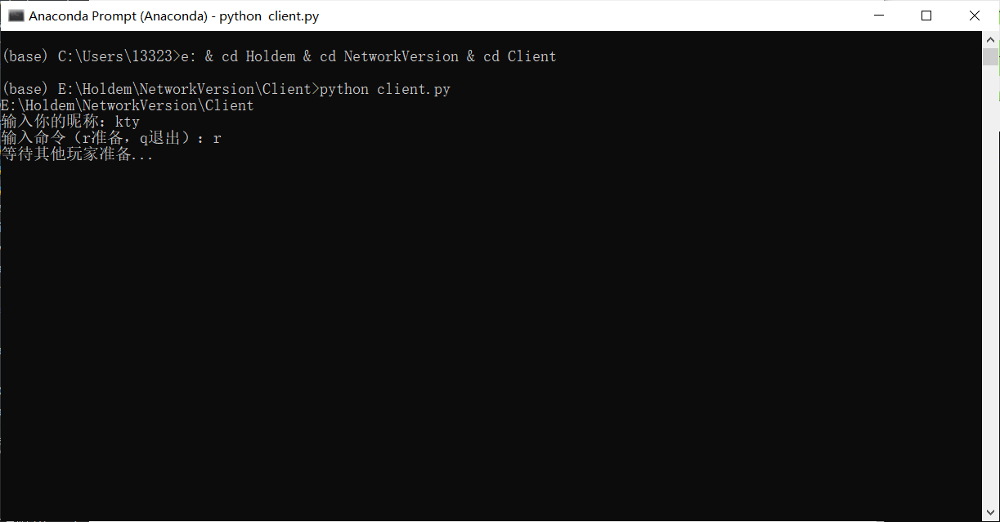

# 德州扑克

### 简介

本项目为命令行版的[德州扑克游戏](https://zh.wikipedia.org/wiki/%E5%BE%B7%E5%B7%9E%E6%92%B2%E5%85%8B)，适合2-10人进行对局。

### 文件简介

- Game目录为单机版的实现，主要用途是自娱自乐（也就是没什么用）以及后续为强化学习AI提供训练环境。
  - 运行：`python main.py`
- NetworkVersion以上面为基础，利用socket实现了客户端和服务器，主要用途是只要在一台服务器上运行server.py，就可以和朋友们愉快地玩耍了。
  - 运行
    - 服务器
      - 首先你得有一台有公网ip的服务器；或者用同一个WiFi的局域网也行（但是就只能连同一个WiFi才能玩）
      - 将server.py的第15行代码改成`ADDRESS = ('0.0.0.0', 1234)  # 绑定地址`，其中1234为你服务器要暴露的端口号（不懂的请google）
      - 然后用服务器运行`python server.py`
    - 客户端
      - 将client.py的第20行代码改成`ADDRESS = ('1.2.3.4', 1234)`，其中1.2.3.4是你的服务器公网ip，1234是你上面暴露的端口号
      - 如果要跟好朋友玩，可以把所有文件发给他
      - 然后运行`python client.py`

### 游戏操作

- 进入游戏前，根据提示键入r，回车，准备。
- 下注操作，一共有四轮下注（发底牌后，翻牌后，转牌后以及河牌后），实际德扑中操作有5个：弃牌、过牌（check）、跟注、加注、All-In，但是我这里把他们合并简化为了3个：1代表弃牌，2代表check或者跟注，3代表加注。
  - 1：弃牌
  - 2：check或者跟注
  - 3：加注，后面还要加上一个参数，代表要比当前最大下注多加多少（相当于先跟注，再在此基础上加）
  - 注意，30秒内不操作会视为弃牌。

### 游戏截图

- 进入游戏

  

- 准备

  

- 开始

  

- 加注

  

- 发三张公共牌

  

- 30s不做操作自动视为弃牌

  

### 程序健壮性

- 我就是写着自己熟人玩的，因此程序的健壮性没有任何保证，很多边际条件都非常脆弱，建议一定要遵守提示来操作。
- 当然有兴趣的小伙伴也可以帮忙改善一下程序的健壮性给我提PR。

### 有点重要但还未实现的功能

- All-in输光后的人的处理~
- 游戏中有人加入、退出的处理
- 游戏进行n局后，对新加入玩家的支持（目前是不支持加入和退出，需要的话要重启服务器，重置筹码，其实对熟人桌游来说这也挺合理的，新加入和退出都要先结算嘛）

### 后续

- 大概会用摸鱼时间来搞搞强化学习的AI和if-else的AI吧。

## V2

改用了更精美的扑克牌显示。

## V3

加入了图形化界面，因为图形化本身也需要线程来跑，所以改动还挺大的。

### 已解决

- 多人游戏时，若有人输光了，则他可以观战，但开始游戏不再需要询问他。
- 服务器在所有人都退出的时候自动重置游戏，这样就不需要重启服务器了。

### 未解决

- 多人游戏时，只剩一人有筹码，就需要重启程序了。